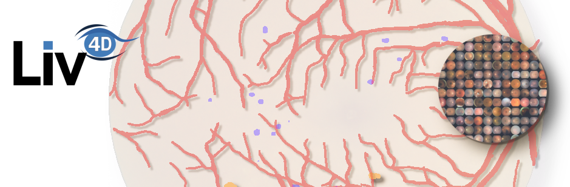

<p align="center">
    
</p>

# Lesion GNN

[](https://rye-up.com)
[](https://pytorch.org/docs/stable/index.html)
[](https://lightning.ai/docs/pytorch/stable/)

## Running the code
To run the code, run the following commands:
```bash
git clone
cd lesion-gnn
pip install .
train --config "configs/<config_name>.py"
```

## Contributing
To contribute to the project, run the following commands:
```bash
git clone
cd lesion-gnn
pip install -e ".[all]"
```
A [devcontainer](https://code.visualstudio.com/docs/devcontainers/containers) setup is also available for VSCode users.
If you want to use the devcontainer to run experiments, install the [devcontainer cli](https://code.visualstudio.com/docs/devcontainers/devcontainer-cli)
and run the following command:
```bash
devcontainer exec --workspace-folder . train --config configs/<config_name>.py
```

Make sure the [pre-commit hooks](https://pre-commit.com/) are installed:
```bash
pre-commit install
```

Test coverage is currently quite low. Any contributions to increase it are welcome. To run the tests, run the following
command:
```bash
pytest --cov=lesion_gnn
```
